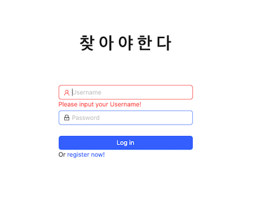
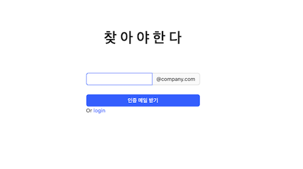
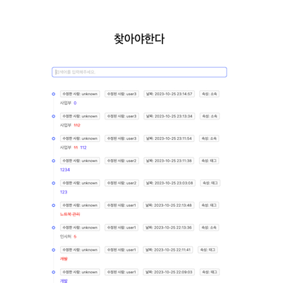
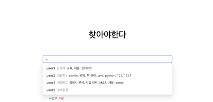
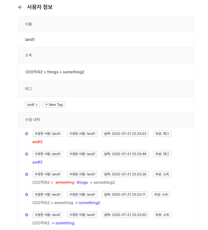

# whois
담장자 찾기 서비스 - [인프런 실전 리액트 프로그래밍 강의](https://www.inflearn.com/course/%EC%8B%A4%EC%A0%84-%EB%A6%AC%EC%95%A1%ED%8A%B8-%ED%94%84%EB%A1%9C%EA%B7%B8%EB%9E%98%EB%B0%8D/dashboard)

# 기술 스택
- react
- typescript
- redux-saga

# Domain
## Auth

|             Login             | SignUp                         |
| :---------------------------: | ------------------------------ |
|  |  |

## Search

| Search(담당자 검색 및 사용자 정보 수정 전체 history 표시) |                 검색 키워드 자동완성 기능                 |
| :-------------------------------------------------------: | :-------------------------------------------------------: |
|                            |  |

## User Detail

| 사용자 정보 상세보기 + 편집 + 수정 history |
| :----------------------------------------: |
|                 |

